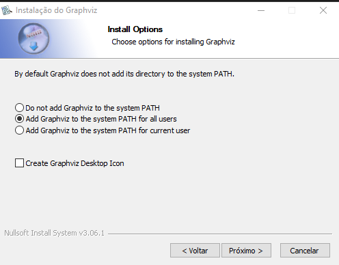

# Minimização de Automato Finito

O principal objetivo da minimização de autômatos é produzir um Autômato Finito (Determinístico - AFD) que seja equivalente ao original, mas que utilize o menor número de estados possível.

Embora esta definição de Autômato Mínimo seja a mais aceita e utilizada na prática, em certas aplicações especializadas—como o projeto de circuitos eletrônicos—a redução do número de estados não garante necessariamente o menor custo de implementação total. Nesses casos, onde a introdução de estados intermediários ou a facilitação de ligações físicas é mais vantajosa, o algoritmo de minimização deve ser adaptado para considerar essas variáveis específicas.

O Autômato Finito Mínimo é único (considerando-se apenas a estrutura, ou seja, a menos de isomorfismo). Assim, quaisquer dois autômatos distintos que reconheçam a mesma linguagem regular resultarão no mesmo Autômato Mínimo, podendo diferir apenas na forma como os estados são nomeados.

O processo de minimização fundamentalmente se baseia na unificação de estados equivalentes:

Dois estados são ditos equivalentes se, e somente se, o processamento de qualquer palavra (cadeia de símbolos) a partir de ambos os estados resulta sempre no mesmo tipo de estado final (ou seja, ambos terminam em um estado de aceitação ou ambos terminam em um estado de não-aceitação).

Em outras palavras, o processamento de qualquer entrada a partir de estados equivalentes produz sempre o mesmo resultado: aceitação ou rejeição.

# Conversões de Automatos Finitos
 
1. **Classificando um automato finito**

1. **Conversão de AFNe para AFN** 

1. **Conversão de AFN para AFD** 

# Minimização de Automato Finito Deterministico

1. **Automato Minimo**

1. **Pré-Requisitos do Algoritimo de Minimização**

1. **Algoritimo de Minimização**

# Configurações

## Graphviz

É uma ferramenta de código aberto para gerar gráficos (diagramas) a partir de descrições textuais. Ele transforma texto em imagens de grafos, como autômatos, fluxogramas e redes, é um software externo que pode ser chamado de dentro de linguagens como Python.

### Instalação:

1. Em [download](https://graphviz.org/download/) baixe a versão *graphviz-14.0.2* que é a usada nesse projeto.
1. Na instalação selecione a opção de adicionar o executável ao system PATH:

    

    OBS: Se estiver executando o projeto dentro do ambiente virtual em um sistema operacional Windows, será necessário adicionar a leitura do executável no PATH do PowerShell. Execute o comando abaixo no PoweShell:
    ```
    $env:Path += ";C:\Program Files\Graphviz\bin"
    ```

## Ambiente Virtual
Para criação do ambiente virtual, execute:
```
python -m venv venv
```
Para ativar o ambiente e começar a desenvolver, execute:
1. Windows: 
    ```
    venv\Scripts\activate
    ```
1. Linux/macOS:
    ```
    source venv/bin/activate
    ```
Após o ambiente ativado, execute o comando abaixo para instalção das dependências:
```bash
pip install -r .\requirements.txt
```
Com as dependências instaladas, incie o jupyter notebook, executando:
```
jupyter notebook
```
Logo, será aberto uma aba no navegador com o projeto, e dentro da pasta **notebooks**, abrir o notebook principal.

## Estrutura do Projeto
O projeto se baseia na hierarquia de diretorios abaixo:
```
minimizacao-de-automato-finito/
│
├─ notebooks/        # Notebooks Jupyter
├─ docs/             # Documentos Gerais
├─ src/              # Código Python reutilizável
├─ data/             # Dados de Entrada/Saída
│   ├─ raw/          # Dados originais (Entrada)
│   └─ processed/    # Dados processados (Saída)
├─ requirements.txt  # Dependências do projeto
└─ README.md         # Documentação de apresentação
```


# Referencias
- Livro: Linguagens Formais e Autômatos Nº3, Paulo Blauth Menezes
- [Linguagens Formais e Autômatos, MVM Ramos - 2008](https://www.marcusramos.com.br/univasf/lfa-2008-1/Apostila.pdf)
